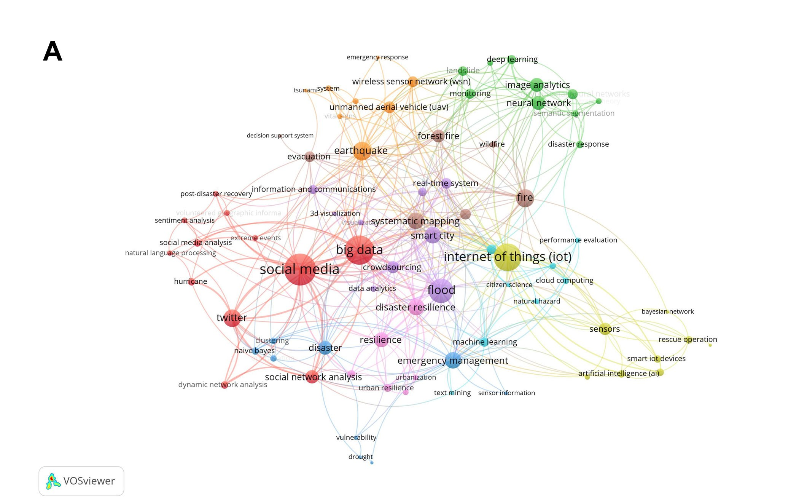

# Research Projects
 

## 1. Environmental Equity and Justice

Investigating the potential of smart city technologies to mitigate environmental inequalities and resource access disparities, with an emphasis on developing equitable and inclusive urban resilience strategies.

    

        
        

            <strong><a href="/research/RedliningNRI">Historical Redlining and Its Impact on Disaster Resilience</a></strong> 
            
A Spatial Analysis Using FEMA's National Risk Index. 
            Examining the influence of redlining on contemporary urban vulnerability and resilience to natural hazards.

        

    

    

        
        

            <strong><a href="/research/HeatVulnerability">Heat Vulnerability in Underserved Communities</a></strong> 
            
Studying the heightened exposure of low-income and minority communities to extreme heat and the role of urban design in mitigating these effects.

        

    

    

        
        

            <strong><a href="/research/LumbertonBuyouts">Disaster Risk and Recovery Disparities</a></strong> 
            
Analyzing variations in disaster preparedness, response, and recovery across socio-economic and racial groups.

        

    

 

______________________________________________________________________________
<table>
<tr>
<td style="width: 300px;" valign="top">
    

        
        
Image from 1935 map of Austin, Texas, with redline demarcations

    

</td>
<td valign="top">
<strong><a href="/research/RedliningNRI" style="font-size: 15px;">
Historical Redlining and Its Impact on Disaster Resilience</a></strong> 
<b>A Spatial Analysis Using FEMA's National Risk Index</b> 
 
Examining the influence of redlining on contemporary urban vulnerability and resilience to natural hazards. 
</td>
</tr>
</table> 

<table>
<tr>
<td style="width: 300px;" valign="top">
    

        
        
Image from Genaro Molina/Los Angeles Times

    

</td>
<td valign="top">
<strong><a href="/research/HeatVulnerability" style="font-size: 15px;">
Heat Vulnerability in Underserved Communities</a></strong> 
Studying the heightened exposure of low-income and minority communities to extreme heat and the role of urban design in mitigating these effects.  
</td>
</tr>
</table> 

<table>
<tr>
<td style="width: 300px;" valign="top">
    

        
        
Image Credit: Kijin Seong, 2019, Natural Hazards Center.

    

</td>
<td valign="top">
<strong><a href="/research/LumbertonBuyouts" style="font-size: 15px;">
Disaster Risk and Recovery Disparities</a></strong> 
Analyzing variations in disaster preparedness, response, and recovery across socio-economic and racial groups.  
</td>
</tr>
</table> 

 

## 2. Urban Environmental Health

Investigating the intersection of urban planning, public health, and smart technologies to enhance the well-being of urban populations, particularly in mitigating the effects of pollution, heat, fire and other environmental stressors.

<table>
<tr>
<td style="width: 300px;" valign="top">
    

        
        
Image from Jerry Lara/San Antonio Express-News.

    

</td>
<td valign="top">
<strong><a href="/research/Clustering" style="font-size: 15px;">
Public Health Impacts of Extreme Heat Events</a></strong> 

Assessing how prolonged heatwaves affect vulnerable populations, with a focus on cardiovascular, respiratory, neurological, and non-severe cases. 
</td>
</tr>
</table> 

<table>
<tr>
<td style="width: 300px;" valign="top">
    

        
        
Image from Provident (https://www.providentins.com/).

    

</td>
<td valign="top">
<strong><a href="/research/EMSDemand" style="font-size: 15px;">
Heat-Related Emergency Medical Services (EMS) Demand</a></strong> 

Exploring spatiotemporal patterns of EMS calls related to heat emergencies and their relationship to environmental factors. 
</td>
</tr>
</table> 

<table>
<tr>
<td style="width: 300px;" valign="top">
    

        
        
Image from Dept. of Homeland Security Science & Technology Directorate.

    

</td>
<td valign="top">
<strong><a href="/research/FireVulnerability" style="font-size: 15px;">
Urban Fire Risk and Vulnerability</a></strong> 

Evaluating the risk of fire in densely populated urban areas and the deployment of smart technologies for early detection and mitigation. 
</td>
</tr>
</table> 

 

##  3. Urban Data Science and Resilience Analytics

Utilizing advanced data science techniques, including AI and machine learning, to model and optimize urban resilience systems, focusing on real-time data collection, analysis, and decision-making for enhancing the resilience of smart cities.

<table>
<tr>
<td style="width: 300px;" valign="top">
    

        
        
Image from Needham Community Council (https://needhamcouncil.org/food-pantry/).

    

</td>
<td valign="top">
<strong><a href="/research/AI-FEED" style="font-size: 15px;">
GeoAI for Food Security Monitoring and Risk Prediction</a></strong> 

Applying GeoAI to map and predict unhealthy food access, areas with limited access to nutritious food, and food distribution gaps. 
</td>
</tr>
</table> 

<table>
<tr>
<td style="width: 300px;" valign="top">
    

        
        
Image from Mitchell Stevenson. Urban Information Lab.

    

</td>
<td valign="top">
<strong><a href="/research/FireDT" style="font-size: 15px;">
Digital Twin for Smart City Resilience</a></strong> 

Developing and applying digital twin technologies to simulate urban environments and enhance decision-making in fire risk management. 
</td>
</tr>
</table> 

<table>
<tr>
<td style="width: 300px;" valign="top">
    

        
        
Image from Earth Economics (https://www.eartheconomics.org/uhi).

    

</td>
<td valign="top">
<strong><a href="/research/TwitterHeat" style="font-size: 15px;">
Topic and Sentiment Analysis on Extreme Heat Events </a></strong> 

Analyzing social media data to understand sentiments around extreme heat events. 
</td>
</tr>
</table> 

<table>
<tr>
<td style="width: 300px;" valign="top">
    

        
        
Image from Kijin Seong (https://doi.org/10.1177/08854122231199).

    

</td>
<td valign="top">
<strong><a href="/research/SystemicReview" style="font-size: 15px;">
Systematic Review of Smart City Frameworks for Disaster Resilience</a></strong> 

Conducting a comprehensive review of how smart city infrastructures improve disaster resilience, with a focus on identifying best practices and knowledge gaps. 
</td>
</tr>
</table> 