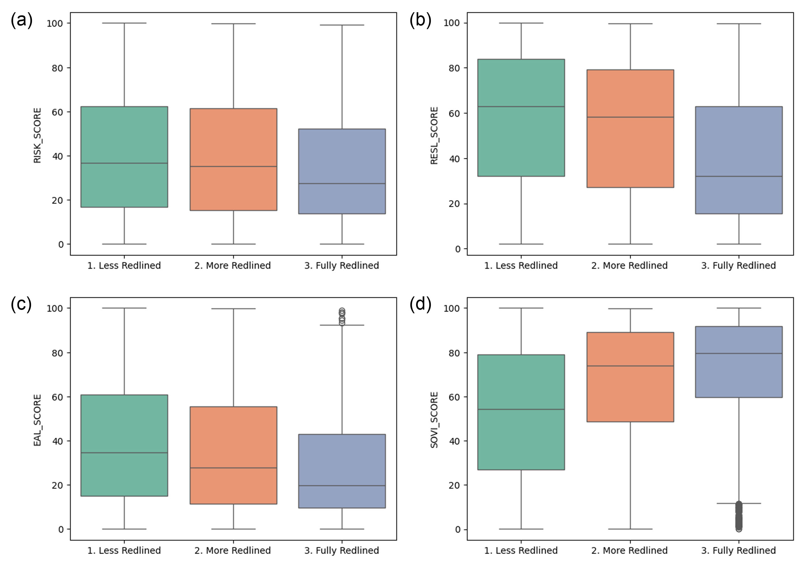

# Historical Redlining and Its Impact on Disaster Resilience

 
 

Figure. Box plot of (a) risk index score, (b) resilience score, (c) social vulnerability score, and (d) expected annual loss by redlining levels across the United States. Source: University of Richmond Mapping Inequality project (Nelson & LaDale, 2023).

 

Table. Spatial error models of risk score, community resilience, expected annual loss, and social vulnerability score with redlining coverage, race/ethnicity, and urban characteristics.

<b>Keywords:</b> redlining; national risk index (NRI); community resilience; environmental justice; equity planning.

<strong><w>Problem, Research Strategy, and Findings</w></strong> 

In recent years, FEMA’s National Risk Index (NRI) has enhanced our understanding of community risk from natural hazards. This study explores gaps in current research by examining the historical influence of redlining on present-day natural hazard risk and resilience, and assessing the NRI’s ability to capture the socio-economic legacies of redlined neighborhoods. Using Kruskal-Wallis tests, the study compares average values across neighborhoods based on redlining severity, and employs spatial regression models to analyze the impact of redlining on resilience and risk metrics. Data sources include the Home Owners’ Loan Corporation (HOLC), FEMA’s NRI, and the American Community Survey (ACS) 2018-2022. Results reveal that historically redlined neighborhoods exhibit higher social vulnerability, lower resilience, and reduced expected annual loss, leading to paradoxically lower hazard risk scores compared to less-affected areas. Spatial error models further show similar associations between redlining and risk factors, while indicating that community resilience increases with higher levels of redlining, even when controlling for race, ethnicity, gentrification, and redevelopment.

<strong><w>Takeaway for Practice</w></strong> 

Spatial inequalities rooted in segregation and disinvestment highlight the need for focused urban planning and policy interventions. For FEMA’s NRI, this includes incorporating measures for long-term financial neglect, enhancing resilience initiatives in redlined communities, and improving data accuracy on social vulnerability and resilience. By augmenting the NRI, FEMA can ensure more equitable evaluations of risk and resilience, making disaster mitigation efforts more effective and just. This study offers practical strategies for urban planners and policymakers to address historical inequities.

